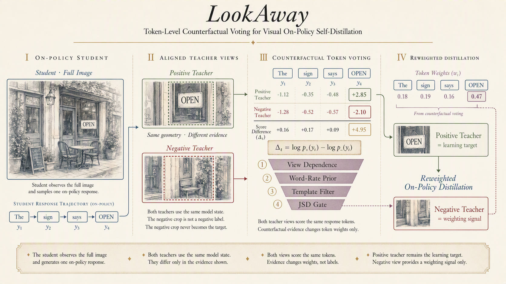
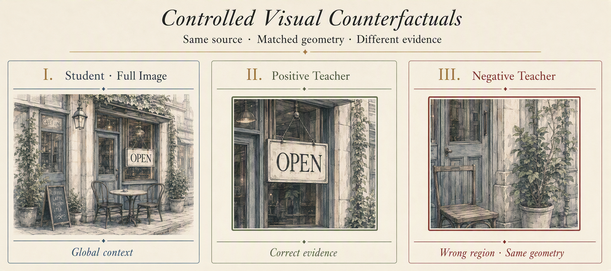

<h1 align="center">LookAway</h1>
<h3 align="center">Token-Level Counterfactual Voting for Visual On-Policy Self-Distillation</h3>

<p align="center">
  <a href="https://github.com/Kaelyn01/LookAway/actions/workflows/ci.yml"></a>
  <a href="https://www.python.org/"></a>
  <a href="LICENSE"></a>
  <a href="https://huggingface.co/datasets/haokaixinmeitiandouhaokaixin/crop-paired-visual-evidence"></a>
</p>

<p align="center">
  <a href="https://arxiv.org/abs/2605.18740">Vision-OPD Paper</a> ·
  <a href="https://huggingface.co/datasets/haokaixinmeitiandouhaokaixin/crop-paired-visual-evidence">Aligned Dataset</a> ·
  <a href="#quick-start">Quick Start</a> ·
  <a href="#method">Method</a> ·
  <a href="#evaluation">Evaluation</a>
</p>

LookAway asks a focused question: **which response tokens genuinely depend on seeing the correct fine-grained evidence?** It extends [Vision-OPD](https://arxiv.org/abs/2605.18740) with an aligned negative teacher view, compares positive and negative teacher scores on the same student trajectory, and converts that counterfactual signal into token-level distillation weights. The positive teacher remains the learning target; the negative view only controls where the objective spends its weight.

<p align="center">
  
</p>
<p align="center"><sub><em>Conceptual method illustration; displayed scores and token weights are illustrative rather than experimental results.</em></sub></p>

## At a glance

| Component | Role | Repository entry point |
| --- | --- | --- |
| Aligned visual conditions | Full image, official positive crop, and geometry-matched negative crop | `scripts/prepare_data.py` |
| Frozen token priors | Word selection rates and template bigrams from a stage-0 dump | `scripts/prepare_priors.py` |
| Counterfactual voting | Positive-vs-negative view dependence plus a four-gate eligibility funnel | `verl/workers/actor/dp_actor.py` |
| Training | Reweighted on-policy self-distillation on the vendored Vision-OPD/verl stack | `scripts/run_lookaway.sh` |
| Evaluation | Revision-pinned benchmark preparation, inference, judging, and metrics | `eval/` |

> [!IMPORTANT]
> CROP `v2.0.0` has complete geometry and rendering verification for all 6,241 pairs. Its regenerated negative images have **not yet received a new semantic review**. Review labels retained in `v1.0.0` describe the earlier negative-image release and must not be transferred to v2.

## Method

For a response sampled from the full-image student, LookAway evaluates every answer token under two aligned teacher views:

<p align="center">
  
</p>

- **Positive teacher:** the official Vision-OPD evidence crop.
- **Negative teacher:** a same-format crop translated to a wrong region while preserving the canvas, crop size, frame, and resize pipeline.

The per-token contrast

```text
Delta_t = log p_pos(y_t) - log p_neg(y_t)
```

measures sensitivity to the visual evidence location. Its magnitude defines the base token weight. A targeted bonus is admitted only through four gates: high view dependence, sufficient word-rate prior, exclusion from frozen template bigrams, and sufficient student-teacher JSD. The resulting weights are mean-normalized over tokens with a valid negative view and applied to the original positive-teacher distillation objective.

This design isolates **where to emphasize learning** without replacing the positive teacher or introducing the negative crop as a target. Threshold quantiles are computed over valid tokens in each training micro-batch.

## Quick start

### 1. Install

```bash
conda create -n lookaway python=3.12
conda activate lookaway

pip install --upgrade pip
pip install --no-deps -r requirements.txt
pip install -e . --no-deps
pip install flash-attn --no-build-isolation
pip install causal-conv1d==1.6.1 --no-build-isolation
```

Set local paths and keep the default model revision pinned:

```bash
export PYTHON=python3
export HF_HOME=./cache/huggingface
export DATA_DIR=./cache/lookaway
export WORK_DIR=./cache/lookaway
export WANDB_MODE=offline
export MODEL_REVISION=851bf6e806efd8d0a36b00ddf55e13ccb7b8cd0a
```

### 2. Prepare aligned data and frozen priors

```bash
${PYTHON} scripts/prepare_data.py \
  --data-dir "$DATA_DIR" \
  --hf-repo yuanqianhao/Vision-OPD-6K \
  --hf-revision eb5c1c2e7b9a7b6a619efe4161c7369c71bf8af4

CUDA_VISIBLE_DEVICES=0 \
${PYTHON} scripts/prepare_priors.py \
  --data-dir "$DATA_DIR" \
  --model-path Qwen/Qwen3.5-4B \
  --model-revision "$MODEL_REVISION"
```

`prepare_data.py` reconstructs and verifies every official positive image before publishing an aligned negative set. `prepare_priors.py` then runs a stage-0 three-view dump and records model, tokenizer, template, generation-result, and Parquet fingerprints. Training rejects stale or mismatched priors.

### 3. Train

```bash
CUDA_VISIBLE_DEVICES=0,1,2,3 \
MODEL_PATH=Qwen/Qwen3.5-4B \
DATA_DIR="$DATA_DIR" \
WORK_DIR="$WORK_DIR" \
bash scripts/run_lookaway.sh
```

Run a two-step smoke test with:

```bash
bash scripts/run_lookaway.sh trainer.total_training_steps=2
```

For the unweighted Vision-OPD recipe, use `bash scripts/run_vision_opd.sh`.

> [!NOTE]
> On CUDA 12.4 systems, Qwen3.5 / `qwen3_next` may require the Triton gated-delta-rule backend. Add `+actor_rollout_ref.rollout.engine_kwargs.vllm.additional_config.gdn_prefill_backend=triton` to the training command, and pass `--additional-config '{"gdn_prefill_backend":"triton"}'` when serving with vLLM.

## Aligned data

The generated `DATA_DIR/train.parquet` contains `neg_bbox_images`, while `results.json` records the recovered geometry, hashes, and rendering parameters. Data preparation guarantees that:

- all 6,241 official positive teacher PNGs are reproduced pixel-exactly and preserved;
- each negative crop inherits the positive crop's canvas, box dimensions, 5-pixel frame, and 2x LANCZOS resize;
- the negative box is translated to a region with IoU `< 0.1` against the target box;
- generation occurs in a staging directory and is published only after the complete dataset passes;
- successful regeneration invalidates stale Parquet and prior artifacts before rebuilding them.

The public [CROP v2.0.0 dataset](https://huggingface.co/datasets/haokaixinmeitiandouhaokaixin/crop-paired-visual-evidence) is an auditable paired-image release. It is not a drop-in replacement for the local Vision-OPD/LookAway training Parquet produced by `prepare_data.py`. The earlier image release remains available under tag `v1.0.0`.

## Training options

All variants are Hydra overrides; no source edit is required. The table shows the values set by `scripts/run_lookaway.sh`. The vendored config defaults keep the `vd_*` mechanisms off.

| Flag | Default launcher value | Meaning |
| --- | --- | --- |
| `self_distillation.vd_dual_signal` | `True` | Use dynamic micro-batch quantiles for view dependence and student gap |
| `self_distillation.vd_base_signal` | `dd` | Use view dependence alone for the base weight (`dual` multiplies by student gap) |
| `self_distillation.vd_gamma` | `1.0` | Base-weight strength |
| `self_distillation.vd_tau` | `2.0` | Fixed-knee scale when `vd_dual_signal=False` |
| `self_distillation.vd_targeted` | `True` | Enable targeted extrapolation |
| `self_distillation.vd_lambda` | `4.0` | Targeted-bonus strength |
| `self_distillation.vd_rate_cut` | `0.12` | Word-rate prior cutoff |
| `self_distillation.vd_jsd_gate` | `True` | Require per-token GJSD above the current micro-batch quantile |
| `self_distillation.vd_jsd_q` | `0.5` | JSD gate quantile |
| `self_distillation.vd_prior_file` | from `DATA_DIR` | Frozen prior file |

The fixed-knee, single-signal variant disables targeted extrapolation and the JSD gate together:

```bash
bash scripts/run_lookaway.sh \
  actor_rollout_ref.actor.self_distillation.vd_targeted=False \
  actor_rollout_ref.actor.self_distillation.vd_jsd_gate=False \
  actor_rollout_ref.actor.self_distillation.vd_dual_signal=False
```

## Checkpoints and serving

Merge a training checkpoint into Hugging Face format:

```bash
bash scripts/merge_checkpoint.sh ./cache/lookaway/checkpoints/<experiment>/global_step_65
```

Serve the merged checkpoint with vLLM:

```bash
vllm serve ./cache/lookaway/checkpoints/<experiment>/global_step_65 \
  --served-model-name LookAway-4B \
  --trust-remote-code \
  --tensor-parallel-size 1 \
  --gpu-memory-utilization 0.85 \
  --port 8000 \
  --additional-config '{"gdn_prefill_backend":"triton"}'
```

## Evaluation

```bash
API_BASE=http://localhost:8000/v1/ \
OPENAI_MODEL_ID=LookAway-4B \
JUDGE_API_BASE=<judge-api-base> \
JUDGE_MODEL=<judge-model-name> \
BENCHMARK=vstar,zoombench \
bash eval/run_eval.sh
```

Supported benchmarks include V*Bench, ZoomBench, HR-Bench, MME-RealWorld, VisualProbe, MMVP, CV-Bench, MMStar, and POPE variants. Exact dataset revisions are pinned in `eval/prepare_data.py`. API credentials are read from `OPENAI_API_KEY` and `JUDGE_API_KEY`; failed inference or exhausted judge retries stop accuracy reporting instead of being silently counted as incorrect.

## Repository map

```text
LookAway/
├── scripts/                # data, priors, training, and checkpoint utilities
├── eval/                   # benchmark preparation and evaluation
├── tests/                  # geometry, weighting, launch, data, and eval regressions
├── verl/                   # vendored Vision-OPD/verl runtime + LookAway integration
├── assets/                 # repository figures and visual assets
├── CITATION.cff
└── NOTICE
```

## Reproducibility and verification

```bash
python -m pip install -r requirements-dev.txt
python -m unittest discover -s tests -v
ruff check scripts eval tests verl/workers/actor/lookaway_utils.py
ruff check --select F \
  verl/workers/actor/dp_actor.py \
  verl/trainer/ppo/ray_trainer.py \
  verl/workers/config/actor.py
bash -n scripts/*.sh eval/*.sh
```

- The repository vendors the Vision-OPD/verl runtime from base revision `c8a8fdd1f88eef1b5ef4fe6a8d64eb0272917471`.
- Training data, the default model, and evaluation datasets are revision-pinned. Pair any alternate remote source with its exact revision.
- The default `Qwen/Qwen3.5-4B` revision is `851bf6e806efd8d0a36b00ddf55e13ccb7b8cd0a`. A trusted local model path does not require a revision.
- Dynamic quantiles depend on micro-batch composition, so record seed, device count, packing, and launch overrides for experimental comparisons.
- `requirements.txt` captures the reproduced environment rather than a minimal abstract dependency set; CUDA and PyTorch wheels remain platform-specific.

## Citation

GitHub exposes the repository citation from [`CITATION.cff`](CITATION.cff). LookAway builds on Vision-OPD; please also cite the original work:

```bibtex
@article{yuan2026vision,
  title={Vision-OPD: Learning to See Fine-Grained Details for Multimodal LLMs via On-Policy Self-Distillation},
  author={Yuan, Qianhao and Lou, Jie and Yu, Xing and Lin, Hongyu and Sun, Le and Han, Xianpei and Lu, Yaojie},
  journal={arXiv preprint arXiv:2605.18740},
  year={2026}
}
```

## License and provenance

Repository code is licensed under [Apache-2.0](LICENSE). See [NOTICE](NOTICE) for the pinned upstream revisions and provenance details. The image dataset is a derived resource governed by separate upstream image terms; review the [CROP dataset card](https://huggingface.co/datasets/haokaixinmeitiandouhaokaixin/crop-paired-visual-evidence) before redistribution or use.
